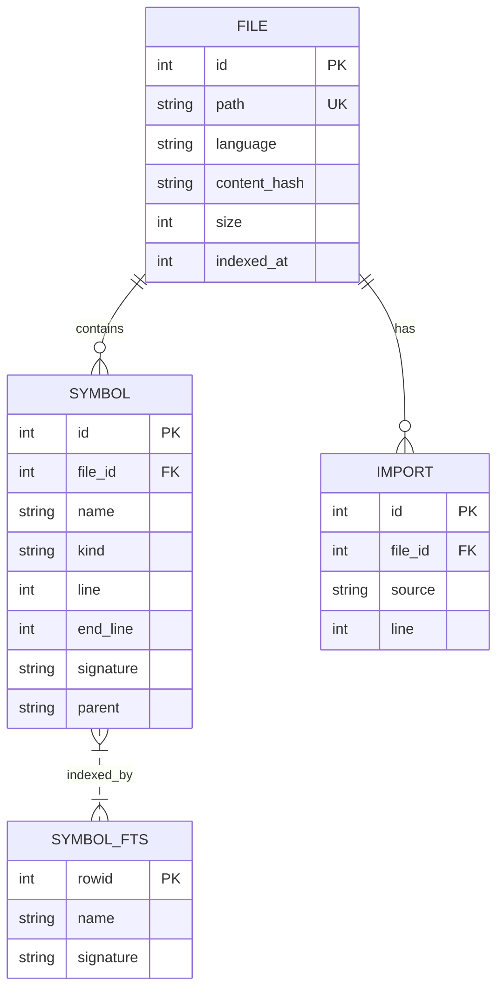
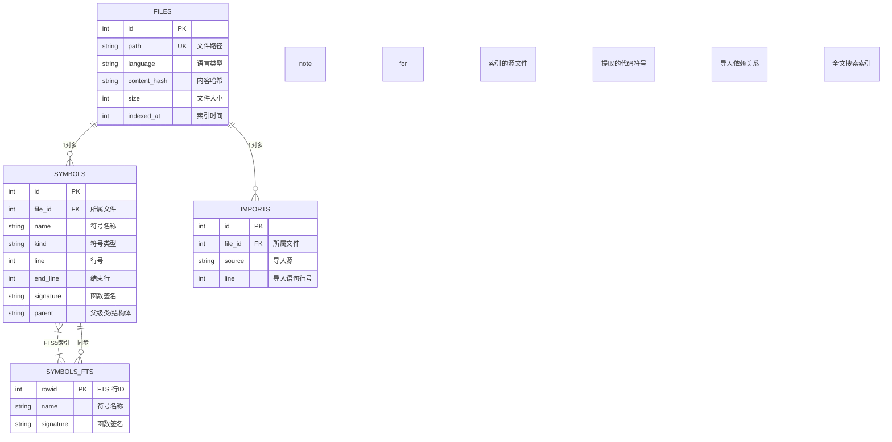
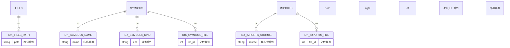

# code-context ER 图

## 1. 核心实体关系图



## 2. 完整数据库 ER 图



## 3. 实体关系详细说明

```mermaid
erDiagram
    USER_CONTEXT ||--o{ FILE_SUMMARY : requests
    FILE_SUMMARY ||--o{ SYMBOL : lists
    FILE_SUMMARY ||--o{ IMPORT_EDGE : shows
    
    SYMBOL ||--o| SYMBOL_KIND : typed_by
    FILE_SUMMARY ||--o| LANGUAGE : parsed_by
    
    IMPORT_EDGE ||--o| FILE : from
    IMPORT_EDGE }o--|| FILE : to
    
    GRAPH {
        string file PK
        string forward "直接依赖"
        string reverse "反向依赖"
    }
    
    USER_CONTEXT {
        string query "用户查询"
        int max_files "最大文件数"
    }
    
    FILE_SUMMARY {
        string path "文件路径"
        string language "语言"
    }
    
    SYMBOL {
        string name "名称"
        int line "行号"
    }
    
    IMPORT_EDGE {
        string to_source "导入源"
        int line "行号"
    }
    
    FILE {
        string path PK
        string content_hash "内容哈希"
    }
    
    SYMBOL_KIND {
        string value "function|method|class|type|interface|variable|constant|module|import|package"
    }
    
    LANGUAGE {
        string value "go|typescript|javascript|python|rust|java"
    }
```

## 4. 索引关系图



## 5. 级联删除关系

```mermaid
erDiagram
    FILES {
        int id PK
    }
    
    SYMBOLS {
        int id PK
        int file_id FK
    }
    
    IMPORTS {
        int id PK
        int file_id FK
    }
    
    SYMBOLS::file_id {
        string on_delete "CASCADE"
    }
    
    IMPORTS::file_id {
        string on_delete "CASCADE"
    }
    
    FILES ||--o{ SYMBOLS : "ON DELETE CASCADE"
    FILES ||--o{ IMPORTS : "ON DELETE CASCADE"
    
    note right of FILES "删除文件时自动删除\n关联的符号和导入"
```

## 6. 数据流转关系

```mermaid
erDiagram
    SOURCE_CODE {
        string file_path "源文件路径"
        string content "源代码内容"
    }
    
    PARSER {
        string language "语言类型"
    }
    
    AST {
        string tree "抽象语法树"
    }
    
    SYMBOL_EXTRACTOR {
        string query "tree-sitter 查询"
    }
    
    IMPORT_EXTRACTOR {
        string pattern "导入匹配模式"
    }
    
    SYMBOLS {
        list symbol "符号列表"
    }
    
    IMPORTS {
        list import "导入列表"
    }
    
    STORE {
        string db_path "数据库路径"
    }
    
    SOURCE_CODE --> PARSER : 读取
    PARSER --> AST : 解析
    AST --> SYMBOL_EXTRACTOR : 提取
    AST --> IMPORT_EXTRACTOR : 提取
    SYMBOL_EXTRACTOR --> SYMBOLS : 输出
    IMPORT_EXTRACTOR --> IMPORTS : 输出
    SYMBOLS --> STORE : 写入
    IMPORTS --> STORE : 写入
    
    note right of STORE "SQLite with FTS5"
```