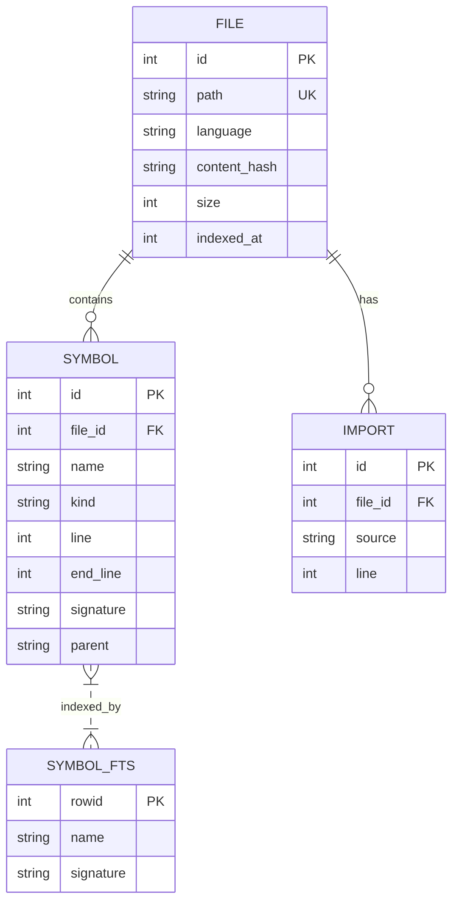
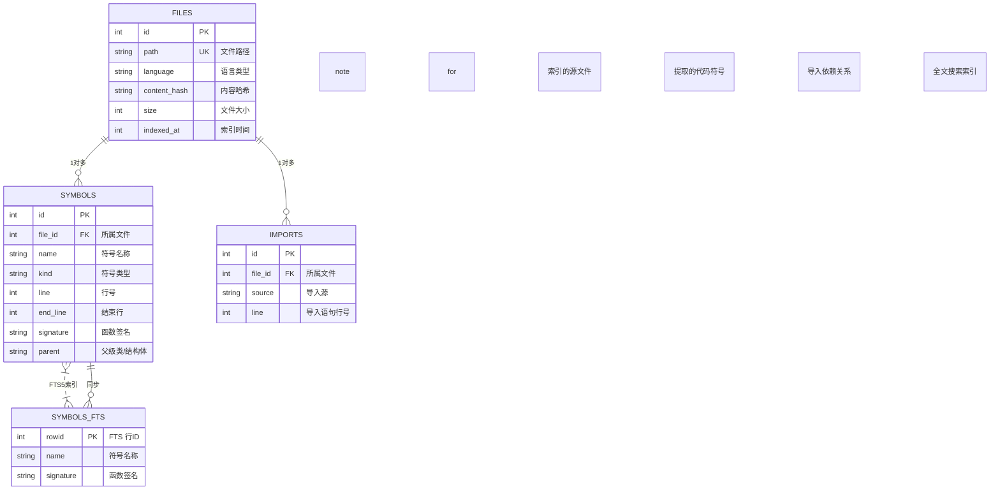
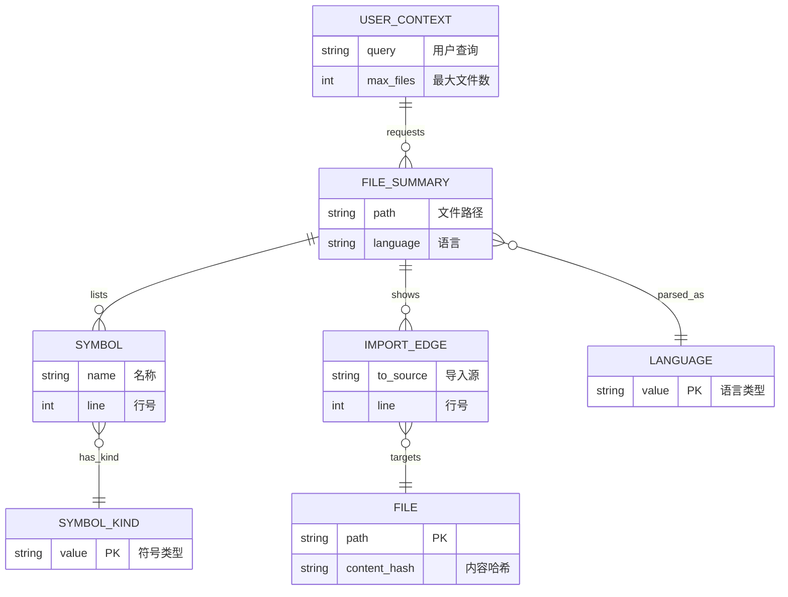
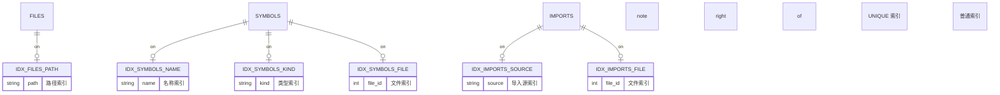
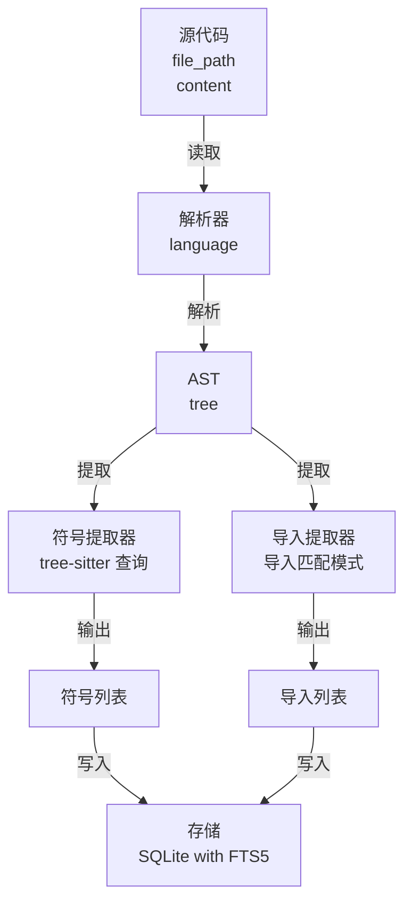

# code-context ER 图

## 1. 核心实体关系图

```mermaid
erDiagram
    FILE ||--o{ SYMBOL : contains
    FILE ||--o{ IMPORT : has
    SYMBOL }|..|{ SYMBOL_FTS : indexed_by
    
    FILE {
        int id PK
        string path UK
        string language
        string content_hash
        int size
        int indexed_at
    }
    
    SYMBOL {
        int id PK
        int file_id FK
        string name
        string kind
        int line
        int end_line
        string signature
        string parent
    }
    
    IMPORT {
        int id PK
        int file_id FK
        string source
        int line
    }
    
    SYMBOL_FTS {
        int rowid PK
        string name
        string signature
    }
```

## 2. 完整数据库 ER 图

```mermaid
erDiagram
    FILES {
        int id PK
        string path UK "文件路径"
        string language "语言类型"
        string content_hash "内容哈希"
        int size "文件大小"
        int indexed_at "索引时间"
    }
    
    SYMBOLS {
        int id PK
        int file_id FK "所属文件"
        string name "符号名称"
        string kind "符号类型"
        int line "行号"
        int end_line "结束行"
        string signature "函数签名"
        string parent "父级类/结构体"
    }
    
    IMPORTS {
        int id PK
        int file_id FK "所属文件"
        string source "导入源"
        int line "导入语句行号"
    }
    
    SYMBOLS_FTS {
        int rowid PK "FTS 行ID"
        string name "符号名称"
        string signature "函数签名"
    }
    
    FILES ||--o{ SYMBOLS : "1对多"
    FILES ||--o{ IMPORTS : "1对多"
    SYMBOLS }|..|{ SYMBOLS_FTS : "FTS5索引"
    
    SYMBOLS_FTS }o--|| SYMBOLS : "同步"
    
    note for FILES "索引的源文件"
    note for SYMBOLS "提取的代码符号"
    note for IMPORTS "导入依赖关系"
    note for SYMBOLS_FTS "全文搜索索引"
```

## 3. 实体关系详细说明

```mermaid
erDiagram
    USER_CONTEXT ||--o{ FILE_SUMMARY : requests
    FILE_SUMMARY ||--o{ SYMBOL : lists
    FILE_SUMMARY ||--o{ IMPORT_EDGE : shows
    FILE_SUMMARY }o--|| LANGUAGE : parsed_as
    SYMBOL }o--|| SYMBOL_KIND : has_kind
    IMPORT_EDGE }o--|| FILE : targets
    
    USER_CONTEXT {
        string query "用户查询"
        int max_files "最大文件数"
    }
    
    FILE_SUMMARY {
        string path "文件路径"
        string language "语言"
    }
    
    SYMBOL {
        string name "名称"
        int line "行号"
    }
    
    IMPORT_EDGE {
        string to_source "导入源"
        int line "行号"
    }
    
    FILE {
        string path PK
        string content_hash "内容哈希"
    }
    
    SYMBOL_KIND {
        string value PK "符号类型"
    }
    
    LANGUAGE {
        string value PK "语言类型"
    }
```

## 4. 索引关系图

```mermaid
erDiagram
    IDX_FILES_PATH {
        string path "路径索引"
    }
    
    IDX_SYMBOLS_NAME {
        string name "名称索引"
    }
    
    IDX_SYMBOLS_KIND {
        string kind "类型索引"
    }
    
    IDX_SYMBOLS_FILE {
        int file_id "文件索引"
    }
    
    IDX_IMPORTS_SOURCE {
        string source "导入源索引"
    }
    
    IDX_IMPORTS_FILE {
        int file_id "文件索引"
    }
    
    FILES ||--o| IDX_FILES_PATH : on
    SYMBOLS ||--o| IDX_SYMBOLS_NAME : on
    SYMBOLS ||--o| IDX_SYMBOLS_KIND : on
    SYMBOLS ||--o| IDX_SYMBOLS_FILE : on
    IMPORTS ||--o| IDX_IMPORTS_SOURCE : on
    IMPORTS ||--o| IDX_IMPORTS_FILE : on
    
    note right of IDX_FILES_PATH "UNIQUE 索引"
    note right of IDX_SYMBOLS_NAME "普通索引"
    note right of IDX_SYMBOLS_KIND "普通索引"
    note right of IDX_SYMBOLS_FILE "普通索引"
    note right of IDX_IMPORTS_SOURCE "普通索引"
    note right of IDX_IMPORTS_FILE "普通索引"
```

## 5. 级联删除关系

```mermaid
erDiagram
    FILES {
        int id PK
    }
    
    SYMBOLS {
        int id PK
        int file_id FK
    }
    
    IMPORTS {
        int id PK
        int file_id FK
    }
    
    SYMBOLS::file_id {
        string on_delete "CASCADE"
    }
    
    IMPORTS::file_id {
        string on_delete "CASCADE"
    }
    
    FILES ||--o{ SYMBOLS : "ON DELETE CASCADE"
    FILES ||--o{ IMPORTS : "ON DELETE CASCADE"
    
    note right of FILES "删除文件时自动删除\n关联的符号和导入"
```

## 6. 数据流转关系

```mermaid
flowchart TD
    SOURCE_CODE["源代码<br/>file_path<br/>content"]
    PARSER["解析器<br/>language"]
    AST["AST<br/>tree"]
    SYMBOL_EXTRACTOR["符号提取器<br/>tree-sitter 查询"]
    IMPORT_EXTRACTOR["导入提取器<br/>导入匹配模式"]
    SYMBOLS["符号列表"]
    IMPORTS["导入列表"]
    STORE["存储<br/>SQLite with FTS5"]

    SOURCE_CODE -->|读取| PARSER
    PARSER -->|解析| AST
    AST -->|提取| SYMBOL_EXTRACTOR
    AST -->|提取| IMPORT_EXTRACTOR
    SYMBOL_EXTRACTOR -->|输出| SYMBOLS
    IMPORT_EXTRACTOR -->|输出| IMPORTS
    SYMBOLS -->|写入| STORE
    IMPORTS -->|写入| STORE
```
