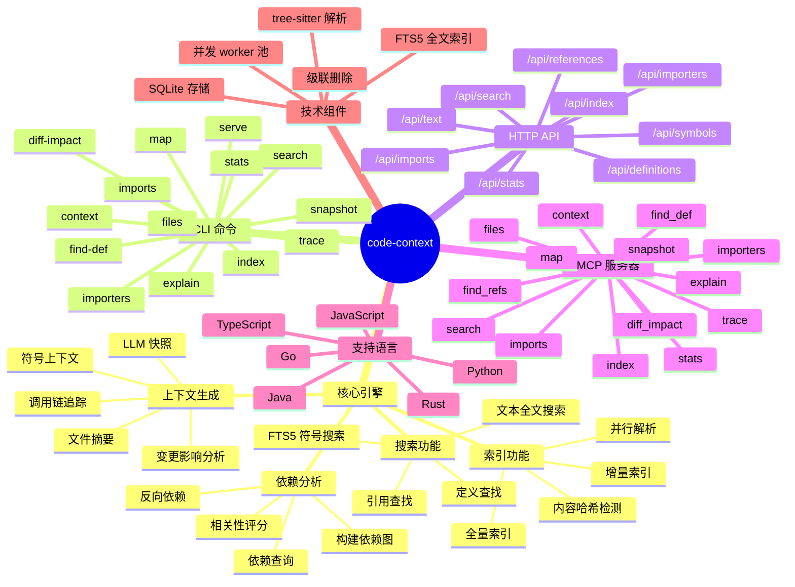
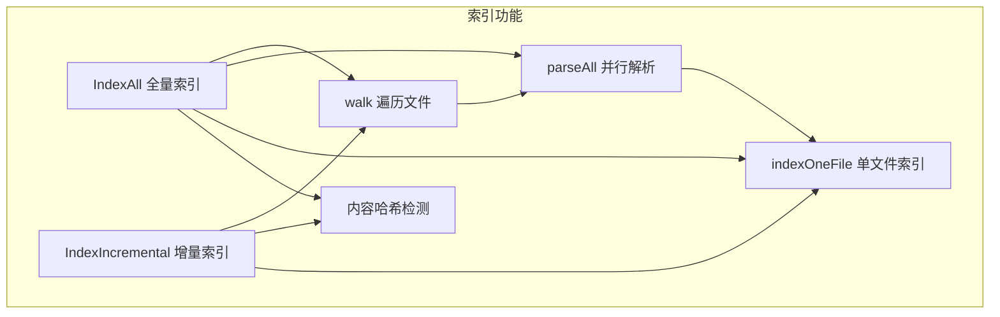
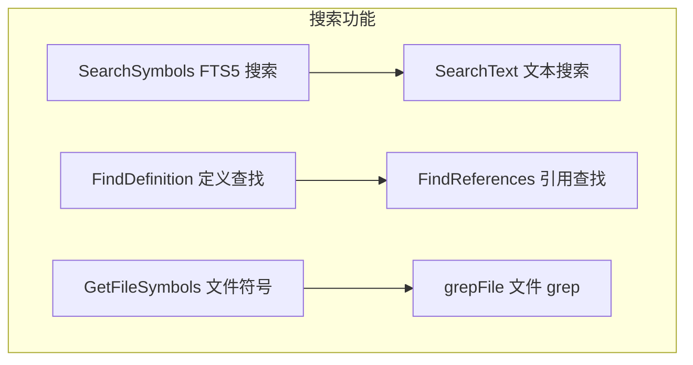
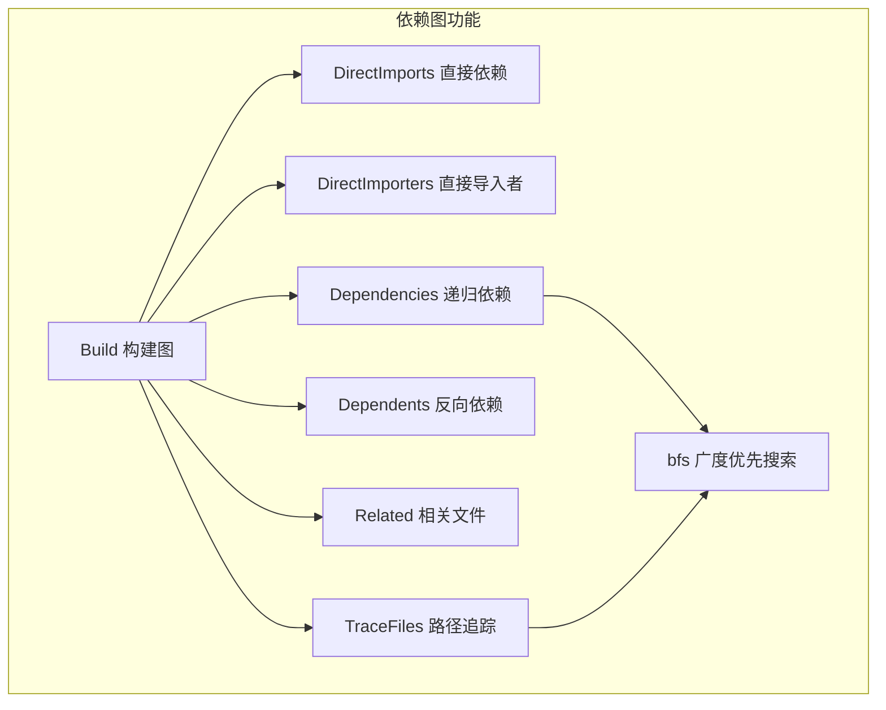
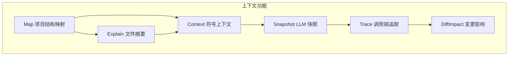
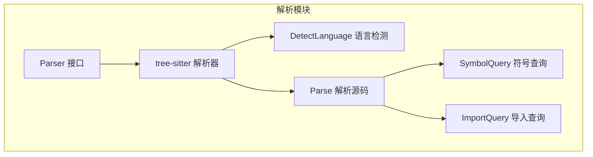
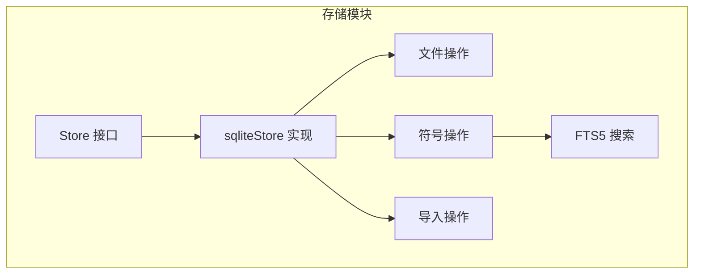
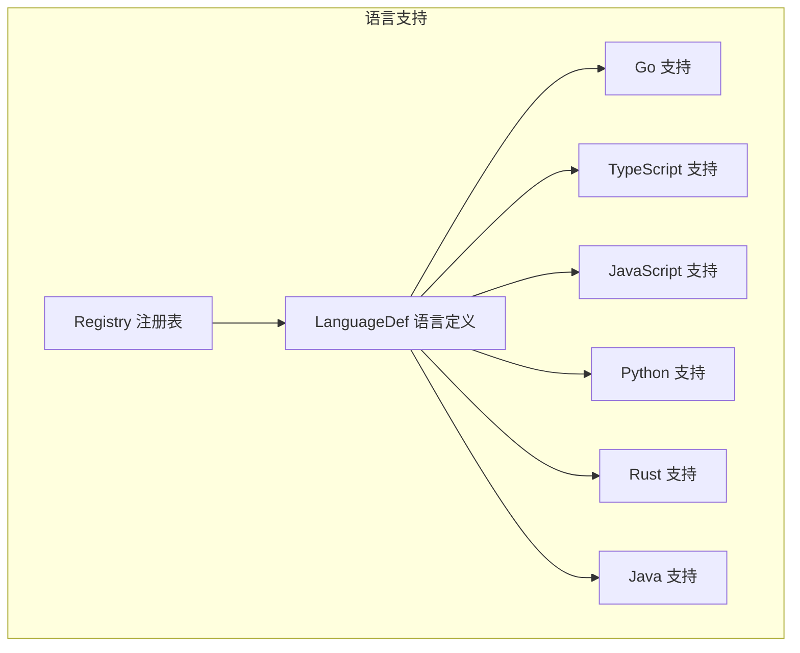
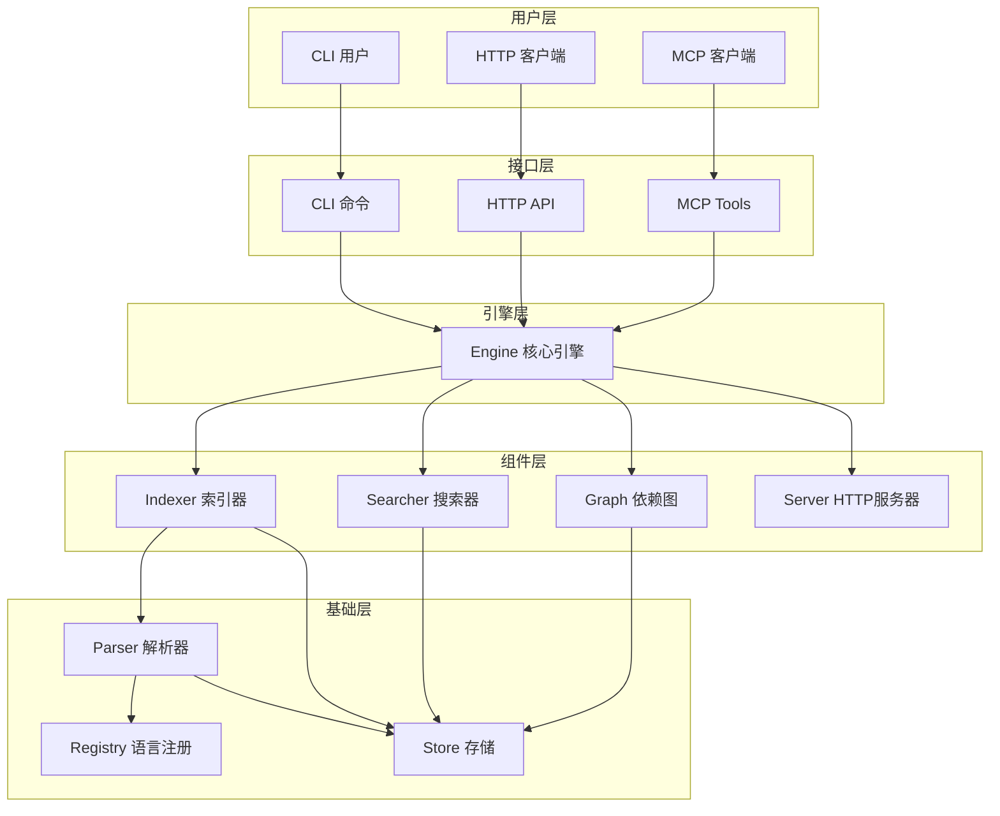

# code-context 功能图

## 1. 系统功能全景图



## 2. 功能模块关系图

```mermaid
graph TD
    subgraph CLI_前端
        A1[index]
        A2[search]
        A3[find-def]
        A4[files]
        A5[imports]
        A6[importers]
        A7[stats]
        A8[map]
        A9[explain]
        A10[context]
        A11[snapshot]
        A12[trace]
        A13[diff-impact]
        A14[serve]
    end
    
    subgraph HTTP_API
        B1[/api/search]
        B2[/api/symbols]
        B3[/api/definitions]
        B4[/api/references]
        B5[/api/text]
        B6[/api/imports]
        B7[/api/importers]
        B8[/api/stats]
        B9[/api/index]
    end
    
    subgraph MCP_Tools
        C1[index]
        C2[search]
        C3[find_def]
        C4[find_refs]
        C5[files]
        C6[imports]
        C7[importers]
        C8[stats]
        C9[map]
        C10[explain]
        C11[context]
        C12[snapshot]
        C13[diff_impact]
        C14[trace]
    end
    
    subgraph Engine_核心
        D1[索引模块]
        D2[搜索模块]
        D3[依赖图模块]
        D4[存储模块]
        D5[解析模块]
    end
    
    A1 --> D1
    A2 --> D2
    A3 --> D2
    A4 --> D4
    A5 --> D4
    A6 --> D4
    A7 --> D4
    A8 --> D4
    A9 --> D4
    A10 --> D4
    A11 --> D2
    A12 --> D3
    A13 --> D3
    
    B1 --> D2
    B2 --> D4
    B3 --> D2
    B4 --> D2
    B5 --> D2
    B6 --> D4
    B7 --> D4
    B8 --> D4
    B9 --> D1
    
    C1 --> D1
    C2 --> D2
    C3 --> D2
    C4 --> D2
    C5 --> D4
    C6 --> D4
    C7 --> D4
    C8 --> D4
    C9 --> D4
    C10 --> D4
    C11 --> D4
    C12 --> D2
    C13 --> D3
    C14 --> D3
    
    D1 --> D5
    D1 --> D4
    D2 --> D4
    D3 --> D4
```

## 3. 索引功能分解



## 4. 搜索功能分解



## 5. 依赖图功能分解



## 6. 上下文功能分解



## 7. 解析器功能分解



## 8. 存储层功能分解



## 9. 语言支持功能分解



## 10. 功能层级图

