# code-context 流程图

## 1. 索引流程

### 1.1 全量索引流程

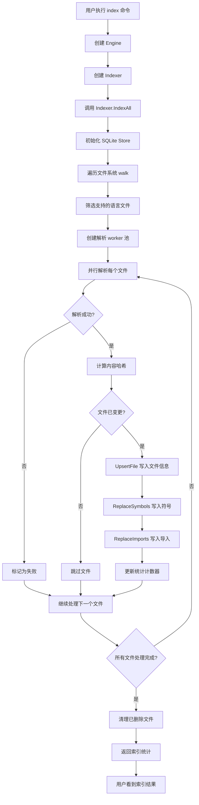

### 1.2 增量索引流程

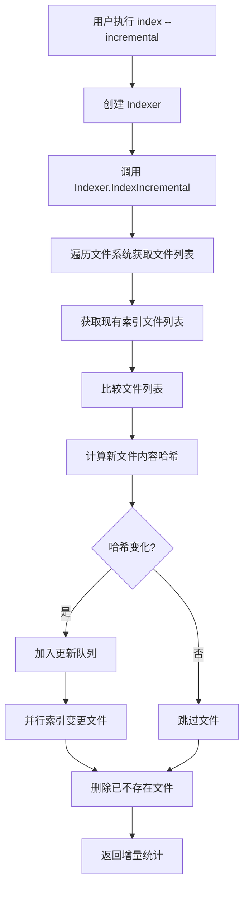

### 1.3 解析流程

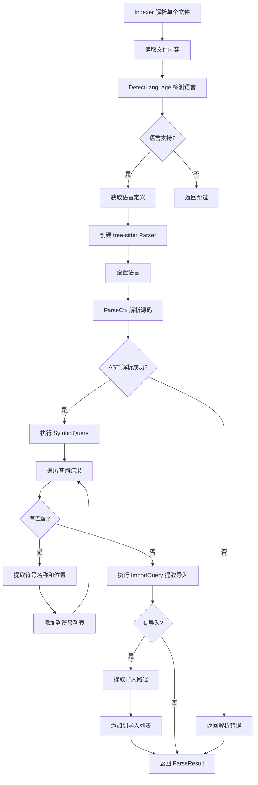

## 2. 搜索流程

### 2.1 符号搜索流程

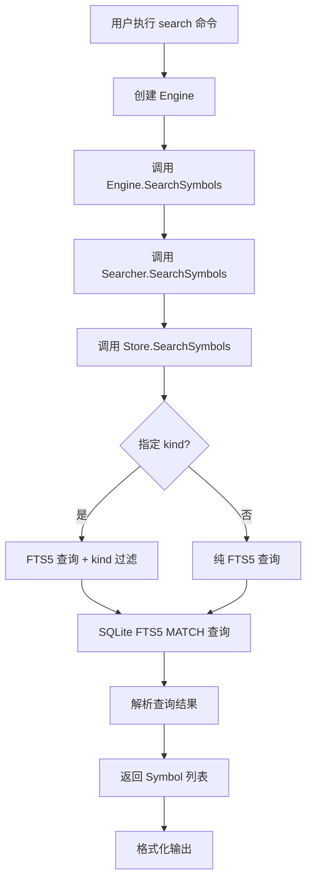

### 2.2 定义查找流程

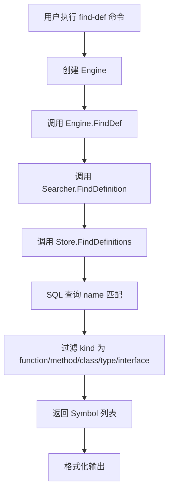

### 2.3 引用查找流程

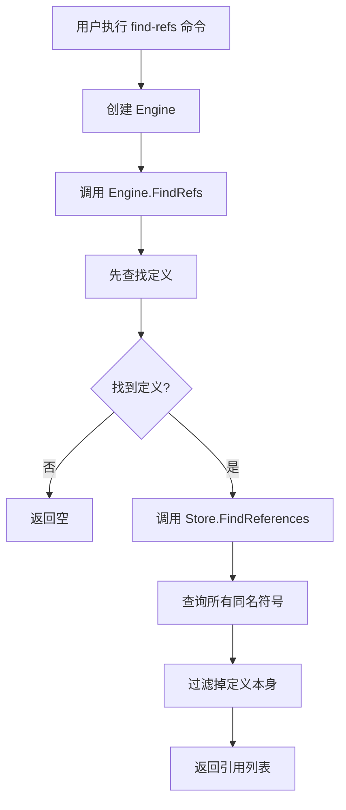

## 3. 依赖图流程

### 3.1 构建依赖图

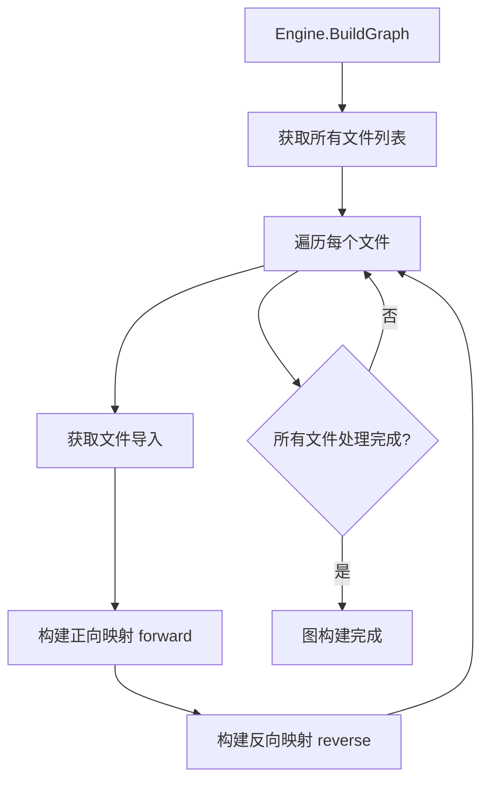

### 3.2 依赖查询

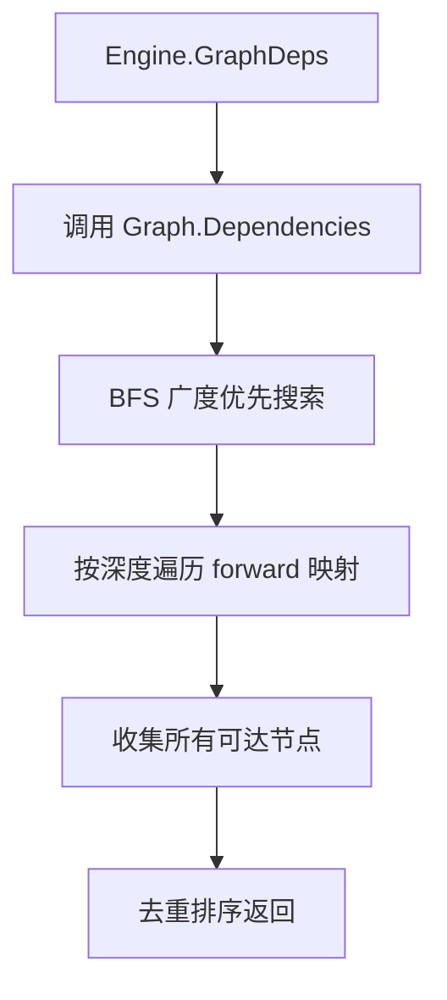

### 3.3 变更影响分析

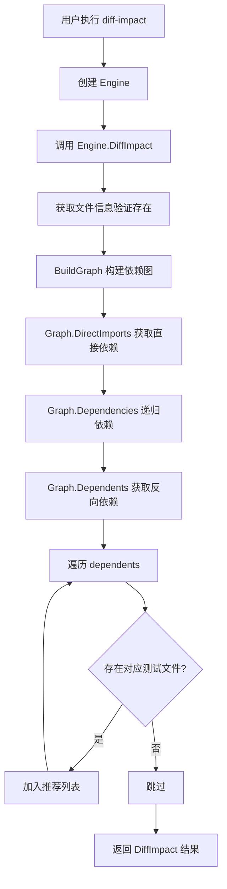

## 4. 上下文生成流程

### 4.1 快照生成

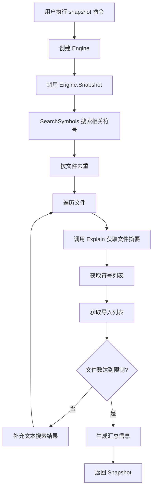

### 4.2 符号上下文

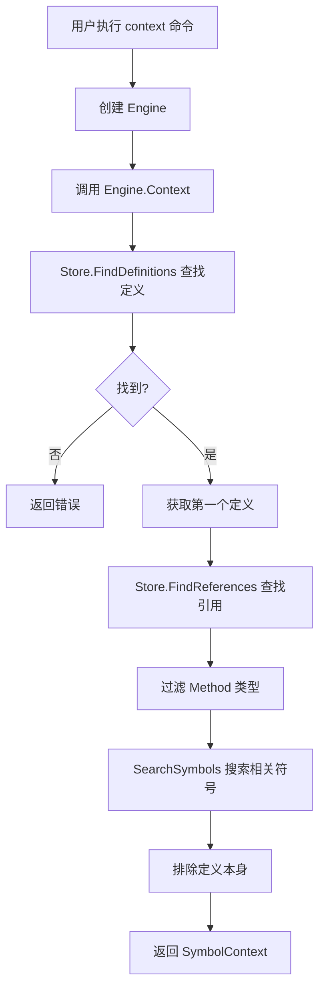

## 5. 追踪流程

### 5.1 调用链追踪

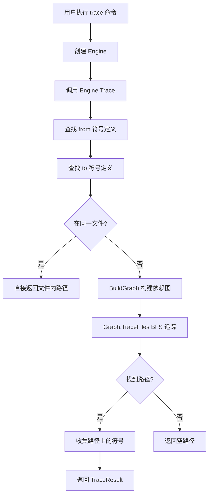

## 6. HTTP API 流程

```mermaid
flowchart TD
    A[启动 HTTP 服务器] --> B[注册路由]
    
    B --> C{收到请求}
    C --> D[/api/search]
    C --> E[/api/symbols]
    C --> F[/api/definitions]
    C --> G[/api/references]
    C --> H[/api/text]
    C --> I[/api/imports]
    C --> J[/api/importers]
    C --> K[/api/stats]
    C --> L[/api/index]
    
    D --> M[调用 Engine.SearchSymbols]
    E --> N[调用 Engine.FileSymbols]
    F --> O[调用 Engine.FindDef]
    G --> P[调用 Engine.FindRefs]
    H --> Q[调用 Engine.SearchText]
    I --> R[调用 Engine.Imports]
    J --> S[调用 Engine.Importers]
    K --> T[调用 Engine.Stats]
    L --> U[调用 Engine.Index/IndexIncremental]
    
    M --> V[JSON 响应]
    N --> V
    O --> V
    P --> V
    Q --> V
    R --> V
    S --> V
    T --> V
    U --> V
```

## 7. MCP 服务器流程

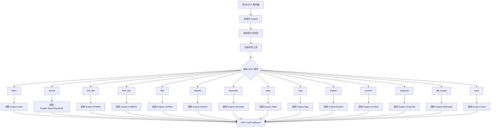