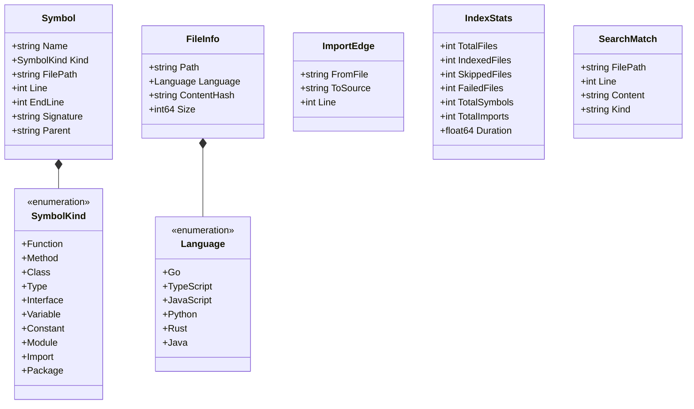
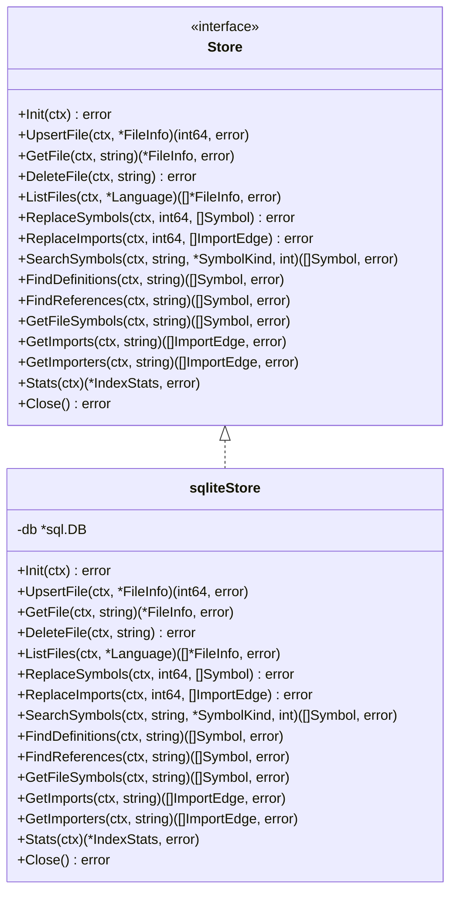
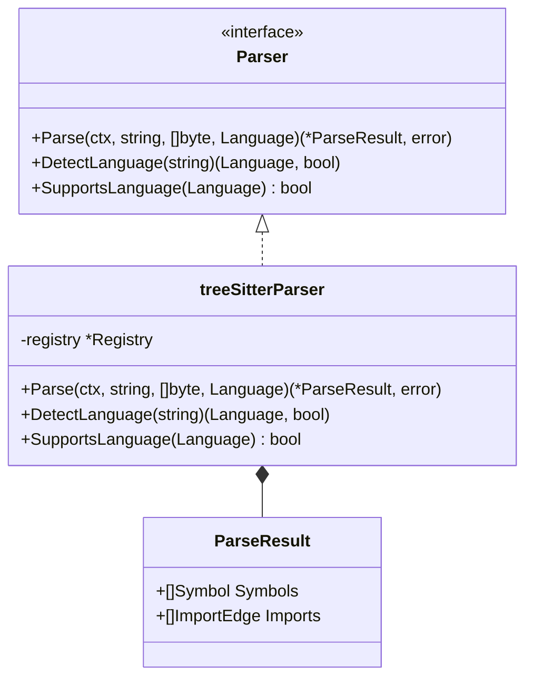
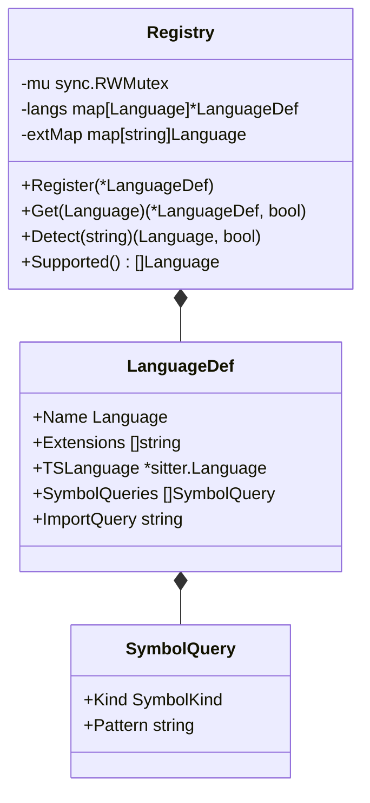
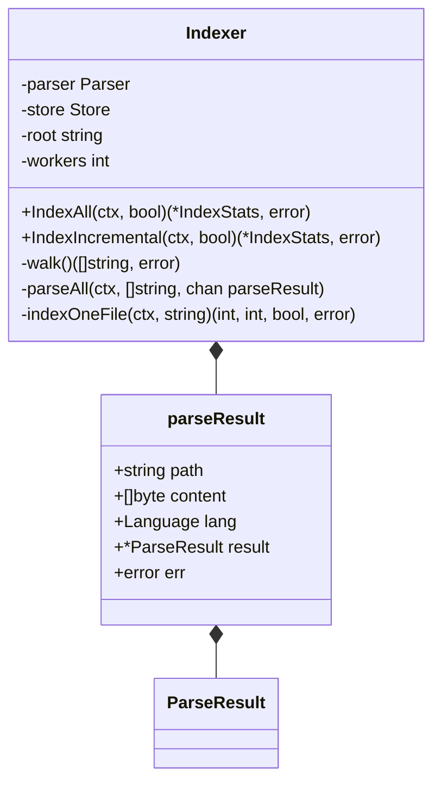
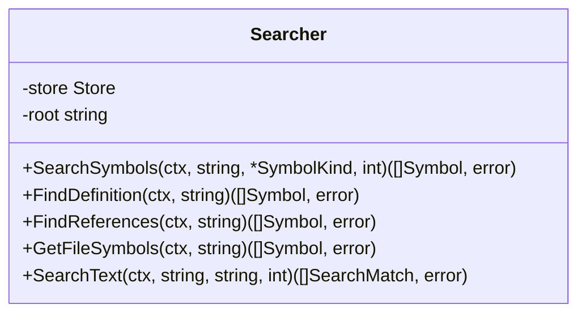
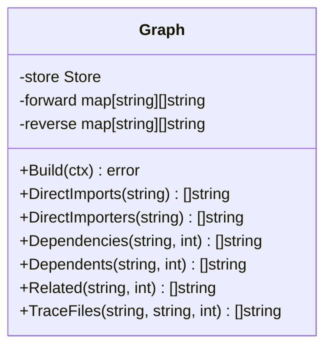
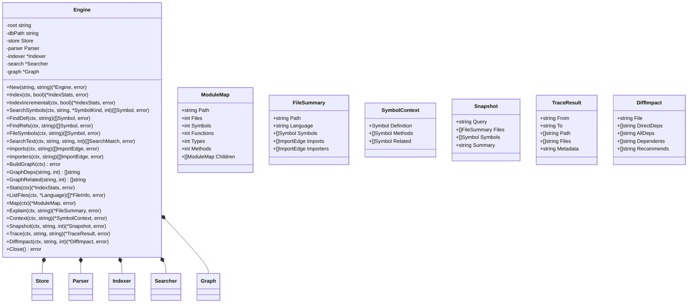

# code-context UML 类图

## 1. 核心类型类图



## 2. 存储层类图



## 3. 解析层类图



## 4. 语言定义类图



## 5. 索引器类图



## 6. 搜索器类图



## 7. 依赖图类图



## 8. 引擎类图



## 9. 服务器类图

```mermaid
classDiagram
    class Server {
        -eng *Engine
        -port int
        +New(*Engine, int) *Server
        +Run() error
        +Handler() http.Handler
    }
    
    class "http.Handler" {
        <<interface>>
        +ServeHTTP(http.ResponseWriter, *http.Request)
    }
    
    Server ..> "http.Handler"
```

## 10. 整体关系图

```mermaid
classDiagram
    Engine --> Parser
    Engine --> Store
    Engine --> Indexer
    Engine --> Searcher
    Engine --> Graph
    
    Indexer --> Parser
    Indexer --> Store
    
    Searcher --> Store
    
    Graph --> Store
    
    Server --> Engine